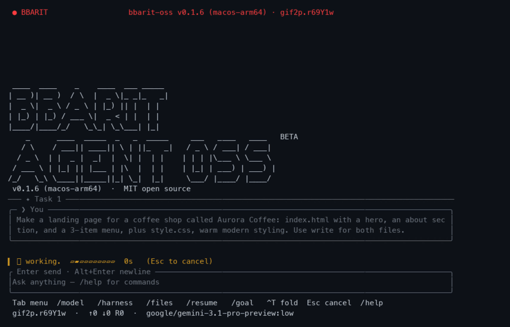

<p align="center">
  
</p>

<h1 align="center">bbarit-oss</h1>

<p align="center">
  
</p>

<p align="center">
  <strong>An open-source AI coding agent for your terminal — written in Rust, one binary, 15+ LLM providers, 1,000+ models.</strong>
</p>

<p align="center">
  <a href="LICENSE"></a>
  
  
  <a href="https://bbarit.com"></a>
  <a href="PROVENANCE.md"></a>
  <a href="CONTRIBUTING.md"></a>
</p>

> **What bbarit-oss is, in one line.**
> **Pi's simplicity + qwen-code's memory + a project wiki + Rust + Pi's gaps
> closed (auto-loads Claude Code & Codex MCP servers and skills) + agent
> personas.**
>
> **한 줄 요약.** **Pi의 단순함 + qwen-code의 메모리 + 프로젝트 위키 + Rust + Pi
> 단점 보완(Claude·Codex의 MCP 서버·스킬 자동 로드) + 에이전트 페르소나.**
>
> **Origin.** bbarit-oss began as the agent **built into
> [BBARIT Terminal](https://bbarit.com)**, our desktop AI coding IDE, and is now
> extracted and released as a standalone open-source CLI.
>
> **Why it's built on [Pi](https://github.com/earendil-works/pi) (MIT).** We
> deliberately inherited Pi's core philosophy — a **small, legible agent loop and
> a tight set of first-class tools** — rather than reinventing the loop or
> reaching for a heavy framework. A coding agent has to be predictable and
> debuggable, and Pi proved a minimal core can still be capable. We kept that
> simplicity and its provider-agnostic model registry, then built well beyond it:
> a multi-process **orchestrator** for parallel sub-agents, a project **wiki**,
> **295 personas**, and bundled **semantic code search**. It is a from-scratch
> **Rust** rewrite — no Pi source lines (comment overlap 0.1%, prose 0%); only
> non-copyrightable design and data (model IDs, endpoints) are shared.
>
> **Why the memory design comes from [qwen-code](https://github.com/QwenLM/qwen-code) (Apache-2.0).**
> Pi has no cross-session memory. Instead of inventing a weaker ontology, we
> adopted qwen-code's proven auto-memory design — its durable-fact taxonomy
> (`user` / `feedback` / `project` / `reference`) and human-readable `MEMORY.md`
> index — and wrote the Rust implementation and prompts ourselves.
>
> **Why Rust.** One self-contained static binary — no Node, no Python, no runtime
> to install. Startup is instant, memory stays low, and parallel sub-agents plus
> live streaming are fast and memory-safe. It cross-compiles to macOS, Linux, and
> Windows as a single file — `curl … | sh` on macOS/Linux, a direct `.exe`
> download on Windows — and `--upgrade` self-updates in place on every platform.
>
> **Why a built-in wiki.** Left to itself, an agent forgets your codebase between
> sessions and burns time and tokens re-deriving how it works. The project wiki
> gives it a durable, human-readable markdown knowledge base about the code —
> architecture, subsystems, gotchas — so it stops re-exploring from scratch and
> stays consistent turn after turn. (Distinct from auto-memory: the wiki is
> knowledge *about the code*; memory is facts *about you and the project*.)
>
> **Why it auto-loads Claude Code & Codex MCP servers and skills (closing a Pi
> gap).** Re-registering MCP servers and skills for every new agent is friction Pi
> never removed. bbarit-oss reads your existing `~/.claude.json` /
> `~/.claude/skills` and `~/.codex/config.toml` / `~/.codex/skills` and reuses
> them **as-is — on by default** (`/interop`), so your tools work on day one with
> zero reconfiguration.
>
> **Why agent personas.** A generic assistant is mediocre at everything. **295
> curated personas** turn the agent into a domain specialist — a backend
> architect, a security auditor, a data-viz designer — each a full personality
> brief (expertise, working style, priorities, taboos), not a one-line "act as X."
>
> The **exact** measured overlap and every difference are disclosed in
> **[PROVENANCE.md](./PROVENANCE.md)**; attributions are in **[NOTICE](./NOTICE)**.

> **한국어 — 왜 Pi를 택했나.** Pi의 핵심 철학, 즉 **작고 읽히는 에이전트 루프와
> 최소한의 1급 도구 세트**를 의도적으로 물려받았습니다 — 루프를 재발명하거나 무거운
> 프레임워크에 기대는 대신. 코딩 에이전트는 예측 가능하고 디버그 가능해야 하며, Pi는
> 최소 코어로도 충분히 유능할 수 있음을 증명했습니다. 그 단순함과 프로바이더 불가지론
> 모델 레지스트리는 그대로 유지하되, 그 위에 멀티프로세스 **오케스트레이터**, 프로젝트
> **위키**, **295 페르소나**, 번들 **시맨틱 코드검색**을 크게 쌓았습니다. **Rust**로
> 처음부터 재작성했으며(Pi 소스 0줄 — 주석 겹침 0.1%, 창작 텍스트 0%), 저작권 대상이
> 아닌 설계·데이터(모델 ID·엔드포인트)만 공유합니다.
>
> **한국어 — 왜 qwen-code의 메모리인가.** Pi에는 세션 간 메모리가 없습니다. 더 약한
> 온톨로지를 새로 만들기보다, qwen-code의 검증된 자동 메모리 설계 — 지속 사실 분류
> (`user` / `feedback` / `project` / `reference`)와 사람이 읽는 `MEMORY.md` 인덱스 —
> 를 채택하고, **Rust 구현과 프롬프트는 직접 작성**했습니다. 출처는 `NOTICE`에 명시.
>
> **한국어 — 왜 Rust로 개발했나.** 런타임 없이 도는 단일 정적 바이너리 —
> Node·Python·node_modules 불필요. 시작이 즉각적이고 메모리가 낮으며, 병렬
> 서브에이전트와 실시간 스트리밍이 빠르고 메모리 안전합니다. macOS·Linux·Windows로
> 크로스컴파일되는 단일 파일 — macOS·Linux는 `curl … | sh`, Windows는 릴리즈에서
> `.exe` 직접 다운로드 — `--upgrade`는 모든 플랫폼에서 제자리 자기업데이트됩니다.
>
> **한국어 — 왜 위키를 쓰나.** 그냥 두면 에이전트는 세션이 바뀔 때마다 코드베이스를
> 잊고 구조를 다시 파악하느라 시간과 토큰을 낭비합니다. 프로젝트 위키는 코드에 대한
> 지속적·사람이 읽는 마크다운 지식베이스(아키텍처·서브시스템·함정)를 에이전트에 줘서,
> 매번 처음부터 재탐색하는 걸 멈추고 턴을 넘어 일관성을 유지하게 합니다. (자동 메모리와
> 구분: 위키는 *코드에 대한* 지식, 메모리는 *당신과 프로젝트에 대한* 사실입니다.)
>
> **한국어 — 왜 Claude·Codex의 MCP 서버·스킬을 자동 로드하나 (Pi 단점 보완).**
> 새 에이전트마다 MCP 서버와 스킬을 다시 등록하는 건 Pi가 없애지 못한 마찰입니다.
> bbarit-oss는 기존 `~/.claude.json` / `~/.claude/skills`, `~/.codex/config.toml` /
> `~/.codex/skills`를 **그대로 읽어 재사용**합니다 — **기본 ON**(`/interop`)이라
> 재설정 없이 첫날부터 도구가 작동합니다.
>
> **한국어 — 왜 에이전트 페르소나인가.** 범용 비서는 모든 걸 어중간하게 합니다. **295개
> 큐레이션 페르소나**가 에이전트를 도메인 전문가(백엔드 아키텍트·보안 감사자·데이터
> 시각화 디자이너)로 바꿉니다 — "act as X" 한 줄이 아니라 전문성·업무 스타일·우선순위·
> 금기를 담은 완전한 성격 브리프입니다.

**bbarit-oss** is a fast, terminal-native **AI coding agent** — an open-source
CLI that reads, writes, and edits your code, runs your shell, searches your
repository, and pair-programs with the LLM of your choice. It ships as a
**single static Rust binary** with no runtime to install, and works with
**Anthropic Claude, OpenAI GPT / Codex, Google Gemini, and a dozen more
providers** (plus local models via Ollama) from one unified model registry.

Think of it as a self-hostable, provider-agnostic alternative to Claude Code,
Codex CLI, and Gemini CLI — you own the keys, the data, and the binary.

---

## Table of contents

- [Why bbarit-oss?](#why-bbarit-oss)
- [Install](#install)
- [Quick start](#quick-start)
- [Usage](#usage)
- [Providers & authentication](#providers--authentication)
- [Tools](#tools)
- [Slash commands](#slash-commands)
- [Personas](#personas)
- [Auto-memory](#auto-memory)
- [Project wiki](#project-wiki)
- [Sessions](#sessions)
- [Skills, extensions, LSP & MCP](#skills-extensions-lsp--mcp)
- [Configuration](#configuration)
- [Self-update](#self-update)
- [Comparison](#comparison)
- [How it works](#how-it-works)
- [Contributing](#contributing)
- [FAQ & troubleshooting](#faq--troubleshooting)
- [Credits & license](#credits--license)

---

## Why bbarit-oss?

- 🦀 **One static binary, no runtime.** No Node, no Python, no `node_modules`.
  Download and run — startup is instant.
- 🔌 **Bring your own model.** Anthropic, OpenAI (+ Codex), Google (Gemini /
  Vertex), OpenRouter, Groq, Mistral, Together, Fireworks, DeepSeek, Cerebras,
  Amazon Bedrock, GitHub Copilot, and local models via **Ollama** — **1,000+
  models** from one registry, switchable mid-session.
- 🔒 **Private by default.** Your keys and code stay on your machine. Nothing is
  hard-coded, no secrets ship in the binary, and it never phones home. Point it
  at a local model and stay fully offline.
- 🧠 **A real agent, with real tools.** It reads and edits files, runs your
  shell, greps and finds, does semantic **code search** over your repo, fetches
  the web, and spawns parallel sub-agents — in an autonomous tool-use loop.
- 🎭 **295 built-in personas** across 30 domains — turn the agent into a
  specialist (backend, SRE, security, data, design, …) with one flag.
- 🧩 **Extensible & standard.** Local skills, extensions, LSP servers, and MCP
  servers plug straight in.
- 🖥️ **A genuinely nice TUI.** Word-wrapped transcript, live token streaming,
  syntax highlighting, model/login pickers, themes, and shell-style history.

## Install

### One line (macOS / Linux)

```sh
curl -fsSL https://bbarit.com/agent/install.sh | sh
```

Downloads a prebuilt `bbarit-oss` binary for your platform and installs it into
`~/.local/bin` (override with `BBARIT_INSTALL_DIR`). Windows binaries are
published on the [releases page](https://github.com/bbarit/bbarit-agent-oss/releases).

### From source

Requires the [Rust toolchain](https://rustup.rs) (stable).

```sh
git clone https://github.com/bbarit/bbarit-agent-oss
cd bbarit-agent-oss
cargo build --release
./target/release/bbarit --help
```

### Supported platforms

| OS | Architectures |
|---|---|
| macOS | Apple Silicon (arm64), Intel (x64) |
| Linux | x64, arm64 |
| Windows | x64 |

## Quick start

```sh
# 1. Launch the interactive TUI in your project directory
cd my-project && bbarit-oss

# 2. First launch with no credentials opens the login picker automatically —
#    pick a provider (OAuth in your browser, or paste an API key). Or any time:
/login anthropic            # also: openai-codex, google, openrouter, groq, ...

# 3. Pick a model (optional — there's a sensible default)
/model claude-sonnet-5

# 4. Just talk to it
add a --json flag to the CLI and update the tests
```

The agent plans, edits files, runs commands, and shows you every tool call. Hit
`Esc` to interrupt; `Up`/`Down` recall previous inputs; `Tab` opens the menu.

## Usage

### Interactive TUI (default)

Run `bbarit-oss` with no arguments to open the full-screen agent in the current
directory. Type instructions in natural language; use `/`-commands for control.

### One-shot (`--print`) — for scripts and other agents

```sh
bbarit-oss --print --no-session \
  --provider anthropic --model claude-sonnet-5 \
  "Explain what this repo does in one paragraph"
```

`stdout` carries **only** the final answer (narration and tool activity go to
`stderr`), so `bbarit-oss --print … 2>/dev/null` is safe to pipe into other tools.

### Structured events (`--mode json`)

Streams newline-delimited JSON (`session` / `agent_start` / `message_update` /
`turn_end` / `agent_end`) for programmatic consumers. See **[CLI.md](./CLI.md)**.

### Parallel sub-agents (`--orchestrate`)

```sh
bbarit-oss --orchestrate "audit auth.rs for bugs" "write tests for parser.rs" "update the README"
```

Runs each task as an independent sub-agent process in parallel and collects the
results.

### Handy flags

| Flag | Effect |
|---|---|
| `--provider <id>` · `--model <id>` | Choose provider / model |
| `--thinking low\|medium\|high` | Reasoning effort |
| `--persona <id>` | Start in a specialist persona |
| `-t, --tools bash,read,edit` | Allowlist tools · `--no-tools` disables all |
| `--no-session` | Don't write a session file |
| `--append-system-prompt "…"` | Extra system instructions |
| `--print` / `--mode json` | Non-interactive output modes |
| `--upgrade` | Update bbarit-oss itself, then exit |

Full list: `bbarit-oss --help`.

## Providers & authentication

One registry, many providers. On a **fresh install with no credentials,
bbarit-oss opens the login picker automatically** on first launch — you're one
keystroke from signing in. After that, log in any time with `/login <provider>`
(OAuth where supported, otherwise an API key), or set the provider's environment
variable.

| Provider | Auth |
|---|---|
| Anthropic (Claude) | OAuth (`claude.ai`) or `ANTHROPIC_API_KEY` |
| OpenAI | `OPENAI_API_KEY` |
| OpenAI Codex (ChatGPT) | OAuth / device login |
| Google Gemini | `GEMINI_API_KEY` |
| Google Vertex | ADC / `GOOGLE_CLOUD_API_KEY` |
| OpenRouter | `OPENROUTER_API_KEY` |
| Groq · Mistral · Together · Fireworks · DeepSeek · Cerebras | provider API key |
| Amazon Bedrock | AWS credentials / profile |
| GitHub Copilot | device login |
| Ollama (local) | none — auto-discovered from `OLLAMA_HOST` |

Switch models any time with `/model`; browse with `/models`.

## Tools

The agent calls these autonomously inside its loop:

| Tool | Purpose |
|---|---|
| `read` · `write` · `edit` | Read and modify files (targeted, hash-checked edits) |
| `bash` | Run shell commands in the project directory |
| `grep` · `find` · `ls` · `tree` | Navigate and search the tree (gitignore-aware) |
| `code_search` | Hybrid BM25 + semantic search over your repo (bundled `semble`) |
| `web_search` · `web_fetch` | Look things up and fetch pages |
| `task` | Spawn a sub-agent for a focused subtask |
| `computer` | Opt-in screenshot + mouse/keyboard control (`/computer on`) |

Restrict what the agent may do with `--tools` / `--exclude-tools` /
`--no-tools`, and gate mutations behind project trust (`--approve`).

## Slash commands

A selection (run `/help` for the full list):

| Command | Description |
|---|---|
| `/login`, `/logout`, `/accounts` | Manage provider credentials |
| `/model`, `/models`, `/providers` | Choose model / provider |
| `/thinking` | Set reasoning effort |
| `/persona` | Adopt a specialist persona |
| `/session`, `/sessions`, `/new`, `/resume`, `/fork`, `/clone` | Session control |
| `/export`, `/import`, `/share` | Save / load / share as HTML |
| `/skills`, `/prompts`, `/themes`, `/extensions` | Load resources |
| `/memory`, `/wiki` | Cross-session memory & project wiki |
| `/lens` | Review your uncommitted changes |
| `/computer on\|off` | Toggle desktop control |
| `/reload`, `/help`, `/quit` | Housekeeping |

## Personas

bbarit-oss ships **295 curated personas** across **30 domains** — engineering,
data/AI, security, SRE, design, product, growth, finance, legal, game dev, and
more. A persona is not a one-line "act as X" hint: each one is a full
**personality brief** (expertise, working style, priorities, taboos) that the
agent adopts completely.

**The library at a glance.** 295 personas across 30 domains — pick one with
`/persona <id|name|search>`, or browse them all in the TUI picker (fuzzy search
across id, name, and description).

| Domain | Count | Examples |
|---|--:|---|
| Specialized | 54 | `accounts-payable-agent`, `agentic-identity-trust` |
| Marketing | 36 | `aeo-foundations`, `agentic-search-optimizer` |
| Engineering | 34 | `ai-data-remediation-engineer`, `ai-engineer` |
| Design | 21 | `accessibility-designer`, `brand-guardian` |
| GIS & mapping | 13 | `3d-scene-developer`, `analyst` |
| Content creation | 12 | `ad-creative-director`, `brand-storyteller` |
| Security | 10 | `appsec-engineer`, `architect` |
| Sales | 9 | `account-strategist`, `coach` |
| Testing | 8 | `accessibility-auditor`, `api-tester` |
| Paid media | 7 | `auditor`, `creative-strategist` |
| Project management | 7 | `experiment-tracker`, `jira-workflow-steward` |
| Spatial computing | 6 | `macos-spatial-metal-engineer`, `terminal-integration-specialist` |
| Support | 6 | `analytics-reporter`, `executive-summary-generator` |
| Academic | 5 | `anthropologist`, `geographer` |
| Finance | 5 | `bookkeeper-controller`, `financial-analyst` |
| Game development | 5 | `game-audio-engineer`, `game-designer` |
| Product | 5 | `behavioral-nudge-engine`, `feedback-synthesizer` |
| Ad performance | 4 | `google-ads-specialist`, `media-buyer` |
| Business & startup | 4 | `biz-dev-manager`, `pricing-strategist` |
| Commerce ops | 4 | `crm-retention-manager`, `ecommerce-operator` |
| Data & AI | 4 | `automation-builder`, `data-analyst` |
| Health & wellness | 4 | `fitness-programmer`, `habit-architect` |
| HR & education | 4 | `career-coach`, `curriculum-designer` |
| Image prompting | 4 | `character-illustrator-prompter`, `midjourney-prompter` |
| Legal & finance | 4 | `accounting-organizer`, `contract-reviewer` |
| Media, audio & photo | 4 | `audio-engineer`, `music-producer` |
| Real estate & space | 4 | `interior-planner`, `office-space-designer` |
| Sales (pro) | 4 | `account-manager`, `outbound-sales-hunter` |
| Video production | 4 | `cinematographer`, `live-stream-pd` |
| Writing & translation | 4 | `book-author-coach`, `speech-writer` |

**Source & license.** The persona briefs are adapted from
[AgentLand](./personas/LICENSE) (MIT, © 2025 AgentLand Contributors); the persona
*system* around them (injection, read-only mode, picker, overrides) is our own.

**How a persona is defined.** Each persona is a markdown file at
`personas/<division>/<id>.md`. The file stem is its stable id, the parent
directory is its division, and the frontmatter carries `name`, `description`,
`emoji`, `color`, and a one-line `vibe`; the body below the frontmatter is the
brief itself. Drop your own `.md` file into a `personas/` directory (project or
user level) and it joins the library — no code changes.

**How to adopt one.**

```sh
bbarit-oss --persona backend-engineer      # at startup (id, name, or search term)
BBARIT_PERSONA=sre-oncall bbarit-oss       # via environment (how a launcher assigns one)
# or in a session:
/persona security-auditor              # adopt
/persona off                           # drop back to the neutral agent
```

The active persona is injected into the system prompt as a
`<persona id="…" name="…">` block, and the TUI title bar shows its emoji +
name badge so you always know **who** the agent currently is. A
`defaultPersona` in settings makes every new session open in character.

**Read-only personas.** A brief containing `%%mode=readonly` turns the persona
into a pure advisor: mutating tools (write/edit/bash/…) are refused while it is
active — perfect for reviewer or auditor personas that must never touch the
tree. The picker lists engineering first, the rest alphabetically, and fuzzy
search works across id, name, and description.

## Auto-memory

The agent remembers what matters **across sessions** — automatically. The
design is adapted from qwen-code (see [PROVENANCE.md](./PROVENANCE.md)); the
implementation is `src/memory.rs`.

**Recall (turn start).** Before each turn, stored memories are scored against
your prompt by keyword overlap — **no LLM call, no added latency** — and the
most relevant ones are injected as background context. The agent simply "knows"
your preferences, your project constraints, and the corrections you made last
week.

**Extraction (turn end).** After a turn, a background `--print` sub-agent reads
the conversation delta and extracts **durable facts only** — things that will
still be useful in future sessions. Each fact is typed:

| Type | What it captures |
|---|---|
| `user` | who you are — role, expertise, preferences |
| `feedback` | corrections and confirmed ways of working ("always X, never Y") |
| `project` | goals, decisions, constraints not derivable from the code |
| `reference` | pointers to external resources |

Extraction is deliberately conservative: it skips transient task state,
anything derivable from code or git history, and it only runs when the turn
added enough new conversation (4+ messages, capped at a 16 KB delta). A
per-session cursor guarantees nothing is extracted twice, and sub-agents
(`BBARIT_SUBAGENT=1`) never extract — no recursive memory loops.

**Storage you can read and edit.** Every memory is a plain
`<slug>.md` file (frontmatter: name, description, type) under the agent's
`memory/` directory, with a one-line-per-memory `MEMORY.md` index. Open them in
any editor; the agent treats your edits as truth.

```sh
/memory                    # list stored memories
/memory show <name>        # view one in full
/memory forget <name>      # delete one
/memory reset              # clear all memories
BBARIT_AUTO_MEMORY=0       # turn the whole feature off
```

## Project wiki

A **per-project knowledge base** the agent maintains as it works
(`src/wiki.rs`). Pages are plain markdown in a shared note vault
(`~/Documents/octo-notes`), with each project scoped to its own
`projects/<slug>/` corner — one project's knowledge is **never** injected into
another project's prompt.

**The agent writes it, you read it — or vice versa.** The `wiki` tool gives the
agent five actions: `get`, `set`, `list`, `search`, `delete`. The system prompt
tells it to record what it learns about the codebase and what it changed, and
to read the wiki back before related work — so hard-won context (build quirks,
architecture decisions, gotchas) survives session boundaries and compactions.

```sh
/wiki                      # list this project's pages
/wiki <query>              # full-text search with snippets
/wiki get <name>           # load and view a note in full
/wiki delete <name>        # delete one note
/wiki reset                # clear this project's notes (other projects untouched)
```

Mutating actions (`set` / `delete`) are gated exactly like file edits: blocked
in plan mode and under read-only personas. Pages are ordinary markdown files —
wikilinks and tags included — so they double as human notes, and BBARIT
Terminal's notes app shows the same vault. Legacy per-project wiki stores are
imported once, without clobbering existing notes.

## Sessions

Every conversation is a **JSONL tree session** you can branch, fork, clone,
rename, resume, and export to self-contained HTML. Sessions live in the agent's
config directory and are pruned to the most recent 30 automatically.

## Reuse your Claude Code & Codex setup

You have probably already wired up MCP servers and skills in **Claude Code** or
**Codex**. bbarit-oss reads those configs **as-is** and loads the same servers
and skills — so your existing toolbox works on the first run, with nothing to
re-register.

Where it looks (highest priority first — first match wins on a name clash):

| Source | MCP servers | Skills |
|---|---|---|
| **This project** | `./.mcp.json` | `.agents/skills/` |
| **bbarit-oss (yours)** | `~/.bbarit-oss/agent/mcp.json` | `~/.bbarit-oss/agent/skills/` |
| **Claude Code** | `~/.claude.json` → `mcpServers` | `~/.claude/skills/`, `./.claude/skills/` |
| **Codex** | `~/.codex/config.toml` → `[mcp_servers]` | `~/.codex/skills/` |

**Read-only, and safe.** bbarit-oss only *reads* Claude/Codex files — it never
writes to another tool's config. Only stdio MCP servers are used; entries marked
`disabled`/`enabled = false` are skipped, exactly as those tools would.

**It is a toggle**, because not everyone wants it:

```sh
/interop            # show current state
/interop off        # ignore Claude/Codex; use only bbarit-oss's own configs
/interop on         # re-enable (the default)
```

Or set `BBARIT_INTEROP=0` in the environment or `~/.bbarit-oss/agent/.env`. The
setting is remembered, and `/settings` shows the live state.

## Skills, extensions, LSP & MCP

- **Skills** — drop `SKILL.md` files (with frontmatter) into a skills directory;
  the agent loads them on demand.
- **Extensions** — local JS/TS extensions can add commands, tools, hooks,
  shortcuts, and even custom providers.
- **LSP** — language servers provide diagnostics and code intelligence.
- **MCP** — connect Model Context Protocol servers to add tools and resources.
  Register one without hand-editing JSON:

  ```sh
  /mcp add filesystem npx -y @modelcontextprotocol/server-filesystem .
  /mcp                 # list servers and how many tools each exposes
  /mcp remove filesystem
  ```

  `/mcp add` writes the entry to this project's `.mcp.json` and connects it
  immediately; the tools appear in the agent's toolset on the next turn.

- **New skills, instantly.** Scaffold a project skill and start editing:

  ```sh
  /skill new deploy-steps "run the deploy checklist in order"
  ```

  This creates `.agents/skills/deploy-steps/SKILL.md` (frontmatter + body) and
  loads it automatically — fill in the body and the agent can pull it in on
  demand.

## Configuration

bbarit-oss is **fully self-contained**: everything lives under its own
`~/.bbarit-oss/agent/` directory — credentials, settings, sessions, memories,
the wiki note vault (`notes/`), and its dotenv (`.env`). It shares **nothing**
with the BBARIT Terminal desktop app or any other tool; installing or removing
it never touches other programs' state. (A legacy `~/.pi/agent` layout is
migrated once, and per-project `./.pi` settings keep working for Pi-ecosystem
compatibility.)

API keys resolve in this order: `--api-key` → stored `/login` credentials →
provider config → environment variables. Nothing is hard-coded and no secrets
are compiled into the binary.

Useful environment variables:

| Variable | Meaning |
|---|---|
| `BBARIT_AGENT_MODE=1` | Agent mode (set when a program pipes to bbarit-oss) |
| `BBARIT_AUTO_CONTEXT=0` | Disable start-of-turn code-context injection |
| `BBARIT_AUTO_MEMORY=0` | Disable auto-memory recall/extract |
| `BBARIT_PERSONA=<id>` | Startup persona |
| `BBARIT_UPDATE_BASE=<url>` | Override the update/install server |

## Self-update

```sh
bbarit-oss --upgrade
```

Checks the release manifest, downloads the latest prebuilt binary for your
platform, and atomically replaces the running executable. Downgrades are
refused, and a failed download never leaves a broken binary behind.

**At startup**, bbarit-oss also checks for a newer release in the background
(non-blocking) and shows a one-line hint when one is available — run `/update`
in the session, or `bbarit-oss --upgrade`. To upgrade automatically at launch,
set `BBARIT_AUTO_UPGRADE=1`; to turn the check off, set `BBARIT_NO_UPDATE_CHECK=1`.

## Comparison

| | bbarit-oss | Claude Code | Codex CLI | Gemini CLI |
|---|---|---|---|---|
| Open source | ✅ MIT | ❌ | ✅ | ✅ |
| Language / runtime | Rust, single binary | Node | Rust | Node |
| Multi-provider | ✅ 15+ | Anthropic | OpenAI | Google |
| Local models (Ollama) | ✅ | ❌ | ❌ | ❌ |
| Built-in personas | ✅ 295 | ❌ | ❌ | ❌ |
| Semantic code search | ✅ bundled | ❌ | ❌ | ❌ |
| Cross-session auto-memory | ✅ | ❌ | ❌ | ❌ |
| Project wiki | ✅ | ❌ | ❌ | ❌ |
| Parallel sub-agents | ✅ multi-process | ❌ | ❌ | ❌ |
| Reuse Claude Code + Codex MCP/skills | ✅ `/interop` | — | — | — |
| MCP support | ✅ | ✅ | ✅ | ✅ |
| Self-update (`--upgrade`) | ✅ every platform | ✅ | ✅ | ✅ |

> Also compared to **[Pi](https://github.com/earendil-works/pi)** (our MIT upstream, TypeScript/Node): bbarit-oss keeps Pi's small, legible core but rewrites it in **Rust** (single binary, no runtime) and adds the orchestrator, wiki, personas, auto-memory, and interop that Pi doesn't have — see [PROVENANCE.md](./PROVENANCE.md) for the exact overlap.

## How it works

```
you ─▶ TUI / CLI ─▶ agent loop ─▶ LLM (your provider)
                        │              │
                        ▼              ▼
                     tools ◀──── tool calls
              (read/edit/bash/search/…)
```

The agent runs an iterative **assistant → tool call → tool result** loop until
the model produces a final answer with no further tool calls. A background,
process-global **code index** (semble) keeps repository search fast without
blocking turns. Context is compacted automatically as sessions grow.

## Contributing

Contributions are welcome — see **[CONTRIBUTING.md](./CONTRIBUTING.md)** and our
**[Code of Conduct](./CODE_OF_CONDUCT.md)**. In short:

```sh
cargo fmt --all
cargo build
cargo test
```

Open an issue for bugs and ideas, or a PR for changes. CI runs fmt, build, and
tests on Linux and macOS (clippy is advisory).

## FAQ & troubleshooting

**How is this different from Claude Code / Codex CLI / Gemini CLI?**
It is open source, model-agnostic (any provider, or a local model), and ships as
a single Rust binary with no runtime.

**Is it related to Pi?**
Yes — its design is based on [Pi](https://github.com/earendil-works/pi) (MIT). It
is an independent Rust rewrite; we publish the exact measured source overlap and
the full list of differences in [PROVENANCE.md](./PROVENANCE.md). If you found Pi
and want a single-binary, multi-provider version, bbarit-oss is it.

**Which LLM providers are supported?**
Anthropic Claude, OpenAI (GPT + Codex), Google Gemini / Vertex, OpenRouter, Groq,
Mistral, Together, Fireworks, DeepSeek, Cerebras, Amazon Bedrock, GitHub Copilot,
and local models via **Ollama** — 15+ providers, 1,000+ models from one registry.

**Can I use it with a local model / offline?**
Yes. Point it at **Ollama** (`/ollama`) to run entirely on your machine — no API
key, no data leaving your computer.

**Is it free?**
The agent is free and open source (MIT). You only pay your own LLM provider (or
run a local model for $0).

**How do I install it on Windows?**
Download `bbarit-oss-windows-x64.exe` from the
[releases page](https://github.com/bbarit/bbarit-agent-oss/releases); `--upgrade`
self-updates it in place. macOS/Linux use `curl … | sh`.

**Is my code private?**
Yes — your keys and code stay on your machine and go only to the provider you
choose. It is fully self-hostable; nothing routes through us.

**`bbarit-oss: command not found` after install.**
Add the install directory to your `PATH`: `export PATH="$HOME/.local/bin:$PATH"`.

**Login didn't open a browser.**
Copy the URL bbarit-oss prints and open it manually; the callback still completes.

**Does it phone home?**
No. Your API keys and code stay on your machine.

## Credits & license

Released under the [MIT License](./LICENSE). Based on
[Pi](https://github.com/earendil-works/pi) (MIT, © 2025 Mario Zechner); Pi's
copyright notice is preserved in [NOTICE](./NOTICE), and the measured source
overlap is disclosed in [PROVENANCE.md](./PROVENANCE.md). Bundles the MIT-licensed
[`semble`](https://github.com/johunsang/semble_rs) code-search engine.

---

<sub>
bbarit-oss — open-source AI coding agent · terminal coding agent · CLI coding
assistant · open-source Claude Code alternative · Codex CLI alternative · Gemini
CLI alternative · Rust coding agent · LLM agent · AI pair programming · autonomous
coding agent · Anthropic Claude · OpenAI GPT · Google Gemini · OpenRouter · Ollama
· local LLM · MCP · developer tools.
</sub>
