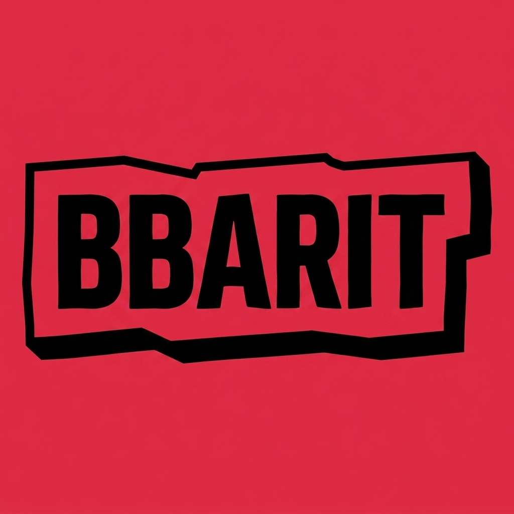

<p align="center">
  
</p>

<h1 align="center">bbarit-agent</h1>

<p align="center">
  <strong>An open-source AI coding agent for your terminal — written in Rust, one binary, 15+ LLM providers, 1,000+ models.</strong>
</p>

<p align="center">
  <a href="LICENSE"></a>
  
  
  <a href="https://bbarit.com"></a>
  <a href="PROVENANCE.md"></a>
  <a href="CONTRIBUTING.md"></a>
</p>

**bbarit-agent** is a fast, terminal-native **AI coding agent** — an open-source
CLI that reads, writes, and edits your code, runs your shell, searches your
repository, and pair-programs with the LLM of your choice. It ships as a
**single static Rust binary** with no runtime to install, and works with
**Anthropic Claude, OpenAI GPT / Codex, Google Gemini, and a dozen more
providers** (plus local models via Ollama) from one unified model registry.

Think of it as a self-hostable, provider-agnostic alternative to Claude Code,
Codex CLI, and Gemini CLI — you own the keys, the data, and the binary.

> **Origin.** bbarit-agent began as the agent **built into
> [BBARIT Terminal](https://bbarit.com)**, our desktop AI coding IDE, and is now
> extracted and released as a standalone open-source CLI.
>
> **Provenance.** Its design is based on [Pi](https://github.com/earendil-works/pi)
> (MIT) — it is a from-scratch **Rust** rewrite with a narrower, terminal-only
> scope and features Pi does not have. We disclose the **exact** measured source
> overlap and every difference in **[PROVENANCE.md](./PROVENANCE.md)**.

---

## Table of contents

- [Why bbarit-agent?](#why-bbarit-agent)
- [Install](#install)
- [Quick start](#quick-start)
- [Usage](#usage)
- [Providers & authentication](#providers--authentication)
- [Tools](#tools)
- [Slash commands](#slash-commands)
- [Personas](#personas)
- [Auto-memory](#auto-memory)
- [Project wiki](#project-wiki)
- [Sessions](#sessions)
- [Skills, extensions, LSP & MCP](#skills-extensions-lsp--mcp)
- [Configuration](#configuration)
- [Self-update](#self-update)
- [Comparison](#comparison)
- [How it works](#how-it-works)
- [Contributing](#contributing)
- [FAQ & troubleshooting](#faq--troubleshooting)
- [Credits & license](#credits--license)

---

## Why bbarit-agent?

- 🦀 **One static binary, no runtime.** No Node, no Python, no `node_modules`.
  Download and run — startup is instant.
- 🔌 **Bring your own model.** Anthropic, OpenAI (+ Codex), Google (Gemini /
  Vertex), OpenRouter, Groq, Mistral, Together, Fireworks, DeepSeek, Cerebras,
  Amazon Bedrock, GitHub Copilot, and local models via **Ollama** — **1,000+
  models** from one registry, switchable mid-session.
- 🔒 **Private by default.** Your keys and code stay on your machine. Nothing is
  hard-coded, no secrets ship in the binary, and it never phones home. Point it
  at a local model and stay fully offline.
- 🧠 **A real agent, with real tools.** It reads and edits files, runs your
  shell, greps and finds, does semantic **code search** over your repo, fetches
  the web, and spawns parallel sub-agents — in an autonomous tool-use loop.
- 🎭 **295 built-in personas** across 32 domains — turn the agent into a
  specialist (backend, SRE, security, data, design, …) with one flag.
- 🧩 **Extensible & standard.** Local skills, extensions, LSP servers, and MCP
  servers plug straight in.
- 🖥️ **A genuinely nice TUI.** Word-wrapped transcript, live token streaming,
  syntax highlighting, model/login pickers, themes, and shell-style history.

## Install

### One line (macOS / Linux)

```sh
curl -fsSL https://bbarit.com/agent/install.sh | sh
```

Downloads a prebuilt `bbarit-oss` binary for your platform and installs it into
`~/.local/bin` (override with `BBARIT_INSTALL_DIR`). Windows binaries are
published on the [releases page](https://github.com/bbarit/bbarit-agent-oss/releases).

### From source

Requires the [Rust toolchain](https://rustup.rs) (stable).

```sh
git clone https://github.com/bbarit/bbarit-agent-oss
cd bbarit-agent
cargo build --release
./target/release/bbarit --help
```

### Supported platforms

| OS | Architectures |
|---|---|
| macOS | Apple Silicon (arm64), Intel (x64) |
| Linux | x64, arm64 |
| Windows | x64 |

## Quick start

```sh
# 1. Launch the interactive TUI in your project directory
cd my-project && bbarit-oss

# 2. Log in to a provider once (opens OAuth in your browser, or paste an API key)
/login anthropic            # also: openai-codex, google, openrouter, groq, ...

# 3. Pick a model (optional — there's a sensible default)
/model claude-sonnet-5

# 4. Just talk to it
add a --json flag to the CLI and update the tests
```

The agent plans, edits files, runs commands, and shows you every tool call. Hit
`Esc` to interrupt; `Up`/`Down` recall previous inputs; `Tab` opens the menu.

## Usage

### Interactive TUI (default)

Run `bbarit-oss` with no arguments to open the full-screen agent in the current
directory. Type instructions in natural language; use `/`-commands for control.

### One-shot (`--print`) — for scripts and other agents

```sh
bbarit-oss --print --no-session \
  --provider anthropic --model claude-sonnet-5 \
  "Explain what this repo does in one paragraph"
```

`stdout` carries **only** the final answer (narration and tool activity go to
`stderr`), so `bbarit-oss --print … 2>/dev/null` is safe to pipe into other tools.

### Structured events (`--mode json`)

Streams newline-delimited JSON (`session` / `agent_start` / `message_update` /
`turn_end` / `agent_end`) for programmatic consumers. See **[CLI.md](./CLI.md)**.

### Parallel sub-agents (`--orchestrate`)

```sh
bbarit-oss --orchestrate "audit auth.rs for bugs" "write tests for parser.rs" "update the README"
```

Runs each task as an independent sub-agent process in parallel and collects the
results.

### Handy flags

| Flag | Effect |
|---|---|
| `--provider <id>` · `--model <id>` | Choose provider / model |
| `--thinking low\|medium\|high` | Reasoning effort |
| `--persona <id>` | Start in a specialist persona |
| `-t, --tools bash,read,edit` | Allowlist tools · `--no-tools` disables all |
| `--no-session` | Don't write a session file |
| `--append-system-prompt "…"` | Extra system instructions |
| `--print` / `--mode json` | Non-interactive output modes |
| `--upgrade` | Update bbarit-oss itself, then exit |

Full list: `bbarit-oss --help`.

## Providers & authentication

One registry, many providers. Log in with `/login <provider>` (OAuth where
supported, otherwise an API key), or set the provider's environment variable.

| Provider | Auth |
|---|---|
| Anthropic (Claude) | OAuth (`claude.ai`) or `ANTHROPIC_API_KEY` |
| OpenAI | `OPENAI_API_KEY` |
| OpenAI Codex (ChatGPT) | OAuth / device login |
| Google Gemini | `GEMINI_API_KEY` |
| Google Vertex | ADC / `GOOGLE_CLOUD_API_KEY` |
| OpenRouter | `OPENROUTER_API_KEY` |
| Groq · Mistral · Together · Fireworks · DeepSeek · Cerebras | provider API key |
| Amazon Bedrock | AWS credentials / profile |
| GitHub Copilot | device login |
| Ollama (local) | none — auto-discovered from `OLLAMA_HOST` |

Switch models any time with `/model`; browse with `/models`.

## Tools

The agent calls these autonomously inside its loop:

| Tool | Purpose |
|---|---|
| `read` · `write` · `edit` | Read and modify files (targeted, hash-checked edits) |
| `bash` | Run shell commands in the project directory |
| `grep` · `find` · `ls` · `tree` | Navigate and search the tree (gitignore-aware) |
| `code_search` | Hybrid BM25 + semantic search over your repo (bundled `semble`) |
| `web_search` · `web_fetch` | Look things up and fetch pages |
| `task` | Spawn a sub-agent for a focused subtask |
| `computer` | Opt-in screenshot + mouse/keyboard control (`/computer on`) |

Restrict what the agent may do with `--tools` / `--exclude-tools` /
`--no-tools`, and gate mutations behind project trust (`--approve`).

## Slash commands

A selection (run `/help` for the full list):

| Command | Description |
|---|---|
| `/login`, `/logout`, `/accounts` | Manage provider credentials |
| `/model`, `/models`, `/providers` | Choose model / provider |
| `/thinking` | Set reasoning effort |
| `/persona` | Adopt a specialist persona |
| `/session`, `/sessions`, `/new`, `/resume`, `/fork`, `/clone` | Session control |
| `/export`, `/import`, `/share` | Save / load / share as HTML |
| `/skills`, `/prompts`, `/themes`, `/extensions` | Load resources |
| `/memory`, `/wiki` | Cross-session memory & project wiki |
| `/lens` | Review your uncommitted changes |
| `/computer on\|off` | Toggle desktop control |
| `/reload`, `/help`, `/quit` | Housekeeping |

## Personas

bbarit-agent ships **295 curated personas** across **32 domains** — engineering,
data/AI, security, SRE, design, product, growth, finance, legal, game dev, and
more. A persona is not a one-line "act as X" hint: each one is a full
**personality brief** (expertise, working style, priorities, taboos) that the
agent adopts completely.

**How a persona is defined.** Each persona is a markdown file at
`personas/<division>/<id>.md`. The file stem is its stable id, the parent
directory is its division, and the frontmatter carries `name`, `description`,
`emoji`, `color`, and a one-line `vibe`; the body below the frontmatter is the
brief itself. Drop your own `.md` file into a `personas/` directory (project or
user level) and it joins the library — no code changes.

**How to adopt one.**

```sh
bbarit-oss --persona backend-engineer      # at startup (id, name, or search term)
BBARIT_PERSONA=sre-oncall bbarit-oss       # via environment (how a launcher assigns one)
# or in a session:
/persona security-auditor              # adopt
/persona off                           # drop back to the neutral agent
```

The active persona is injected into the system prompt as a
`<persona id="…" name="…">` block, and the TUI title bar shows its emoji +
name badge so you always know **who** the agent currently is. A
`defaultPersona` in settings makes every new session open in character.

**Read-only personas.** A brief containing `%%mode=readonly` turns the persona
into a pure advisor: mutating tools (write/edit/bash/…) are refused while it is
active — perfect for reviewer or auditor personas that must never touch the
tree. The picker lists engineering first, the rest alphabetically, and fuzzy
search works across id, name, and description.

## Auto-memory

The agent remembers what matters **across sessions** — automatically. The
design is adapted from qwen-code (see [PROVENANCE.md](./PROVENANCE.md)); the
implementation is `src/memory.rs`.

**Recall (turn start).** Before each turn, stored memories are scored against
your prompt by keyword overlap — **no LLM call, no added latency** — and the
most relevant ones are injected as background context. The agent simply "knows"
your preferences, your project constraints, and the corrections you made last
week.

**Extraction (turn end).** After a turn, a background `--print` sub-agent reads
the conversation delta and extracts **durable facts only** — things that will
still be useful in future sessions. Each fact is typed:

| Type | What it captures |
|---|---|
| `user` | who you are — role, expertise, preferences |
| `feedback` | corrections and confirmed ways of working ("always X, never Y") |
| `project` | goals, decisions, constraints not derivable from the code |
| `reference` | pointers to external resources |

Extraction is deliberately conservative: it skips transient task state,
anything derivable from code or git history, and it only runs when the turn
added enough new conversation (4+ messages, capped at a 16 KB delta). A
per-session cursor guarantees nothing is extracted twice, and sub-agents
(`BBARIT_SUBAGENT=1`) never extract — no recursive memory loops.

**Storage you can read and edit.** Every memory is a plain
`<slug>.md` file (frontmatter: name, description, type) under the agent's
`memory/` directory, with a one-line-per-memory `MEMORY.md` index. Open them in
any editor; the agent treats your edits as truth.

```sh
/memory                    # list stored memories
/memory forget <name>      # delete one
BBARIT_AUTO_MEMORY=0       # turn the whole feature off
```

## Project wiki

A **per-project knowledge base** the agent maintains as it works
(`src/wiki.rs`). Pages are plain markdown in a shared note vault
(`~/Documents/octo-notes`), with each project scoped to its own
`projects/<slug>/` corner — one project's knowledge is **never** injected into
another project's prompt.

**The agent writes it, you read it — or vice versa.** The `wiki` tool gives the
agent five actions: `get`, `set`, `list`, `search`, `delete`. The system prompt
tells it to record what it learns about the codebase and what it changed, and
to read the wiki back before related work — so hard-won context (build quirks,
architecture decisions, gotchas) survives session boundaries and compactions.

```sh
/wiki                      # list this project's pages
/wiki <query>              # full-text search with snippets
```

Mutating actions (`set` / `delete`) are gated exactly like file edits: blocked
in plan mode and under read-only personas. Pages are ordinary markdown files —
wikilinks and tags included — so they double as human notes, and BBARIT
Terminal's notes app shows the same vault. Legacy per-project wiki stores are
imported once, without clobbering existing notes.

## Sessions

Every conversation is a **JSONL tree session** you can branch, fork, clone,
rename, resume, and export to self-contained HTML. Sessions live in the agent's
config directory and are pruned to the most recent 30 automatically.

## Skills, extensions, LSP & MCP

- **Skills** — drop `SKILL.md` files (with frontmatter) into a skills directory;
  the agent loads them on demand.
- **Extensions** — local JS/TS extensions can add commands, tools, hooks,
  shortcuts, and even custom providers.
- **LSP** — language servers provide diagnostics and code intelligence.
- **MCP** — connect Model Context Protocol servers to add tools and resources.

## Configuration

bbarit-agent is **fully self-contained**: everything lives under its own
`~/.bbarit-oss/agent/` directory — credentials, settings, sessions, memories,
the wiki note vault (`notes/`), and its dotenv (`.env`). It shares **nothing**
with the BBARIT Terminal desktop app or any other tool; installing or removing
it never touches other programs' state. (A legacy `~/.pi/agent` layout is
migrated once, and per-project `./.pi` settings keep working for Pi-ecosystem
compatibility.)

API keys resolve in this order: `--api-key` → stored `/login` credentials →
provider config → environment variables. Nothing is hard-coded and no secrets
are compiled into the binary.

Useful environment variables:

| Variable | Meaning |
|---|---|
| `BBARIT_AGENT_MODE=1` | Agent mode (set when a program pipes to bbarit-oss) |
| `BBARIT_AUTO_CONTEXT=0` | Disable start-of-turn code-context injection |
| `BBARIT_AUTO_MEMORY=0` | Disable auto-memory recall/extract |
| `BBARIT_PERSONA=<id>` | Startup persona |
| `BBARIT_UPDATE_BASE=<url>` | Override the update/install server |

## Self-update

```sh
bbarit-oss --upgrade
```

Checks the release manifest, downloads the latest prebuilt binary for your
platform, and atomically replaces the running executable.

## Comparison

| | bbarit-agent | Claude Code | Codex CLI | Gemini CLI |
|---|---|---|---|---|
| Open source | ✅ MIT | ❌ | ✅ | ✅ |
| Language / runtime | Rust, single binary | Node | Rust | Node |
| Multi-provider | ✅ 15+ | Anthropic | OpenAI | Google |
| Local models (Ollama) | ✅ | ❌ | ❌ | ❌ |
| Built-in personas | ✅ 295 | ❌ | ❌ | ❌ |
| Semantic code search | ✅ bundled | ❌ | ❌ | ❌ |
| MCP support | ✅ | ✅ | ✅ | ✅ |

## How it works

```
you ─▶ TUI / CLI ─▶ agent loop ─▶ LLM (your provider)
                        │              │
                        ▼              ▼
                     tools ◀──── tool calls
              (read/edit/bash/search/…)
```

The agent runs an iterative **assistant → tool call → tool result** loop until
the model produces a final answer with no further tool calls. A background,
process-global **code index** (semble) keeps repository search fast without
blocking turns. Context is compacted automatically as sessions grow.

## Contributing

Contributions are welcome — see **[CONTRIBUTING.md](./CONTRIBUTING.md)** and our
**[Code of Conduct](./CODE_OF_CONDUCT.md)**. In short:

```sh
cargo fmt --all
cargo build
cargo test
```

Open an issue for bugs and ideas, or a PR for changes. CI runs fmt, build, and
tests on Linux and macOS (clippy is advisory).

## FAQ & troubleshooting

**How is this different from Claude Code / Codex CLI / Gemini CLI?**
It is open source, model-agnostic (any provider, or a local model), and ships as
a single Rust binary with no runtime.

**Is it related to Pi?**
Yes — its design is based on [Pi](https://github.com/earendil-works/pi) (MIT). It
is an independent Rust rewrite; we publish the exact measured source overlap and
the full list of differences in [PROVENANCE.md](./PROVENANCE.md).

**`bbarit-oss: command not found` after install.**
Add the install directory to your `PATH`: `export PATH="$HOME/.local/bin:$PATH"`.

**Login didn't open a browser.**
Copy the URL bbarit-oss prints and open it manually; the callback still completes.

**Does it phone home?**
No. Your API keys and code stay on your machine.

## Credits & license

Released under the [MIT License](./LICENSE). Based on
[Pi](https://github.com/earendil-works/pi) (MIT, © 2025 Mario Zechner); Pi's
copyright notice is preserved in [NOTICE](./NOTICE), and the measured source
overlap is disclosed in [PROVENANCE.md](./PROVENANCE.md). Bundles the MIT-licensed
[`semble`](https://github.com/johunsang/semble_rs) code-search engine.

---

<sub>
bbarit-agent — open-source AI coding agent · terminal coding agent · CLI coding
assistant · open-source Claude Code alternative · Codex CLI alternative · Gemini
CLI alternative · Rust coding agent · LLM agent · AI pair programming · autonomous
coding agent · Anthropic Claude · OpenAI GPT · Google Gemini · OpenRouter · Ollama
· local LLM · MCP · developer tools.
</sub>
